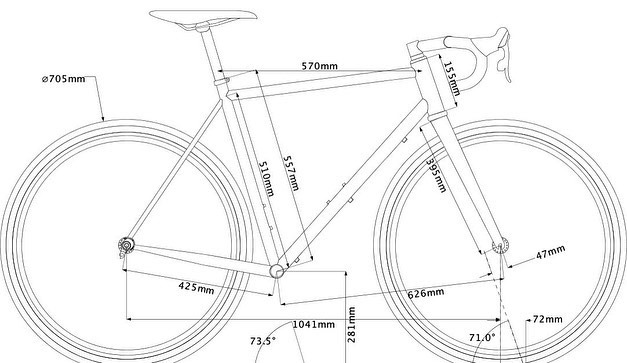
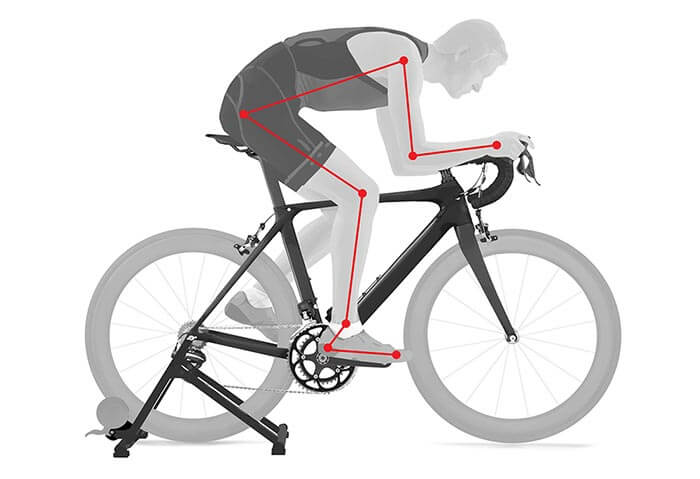
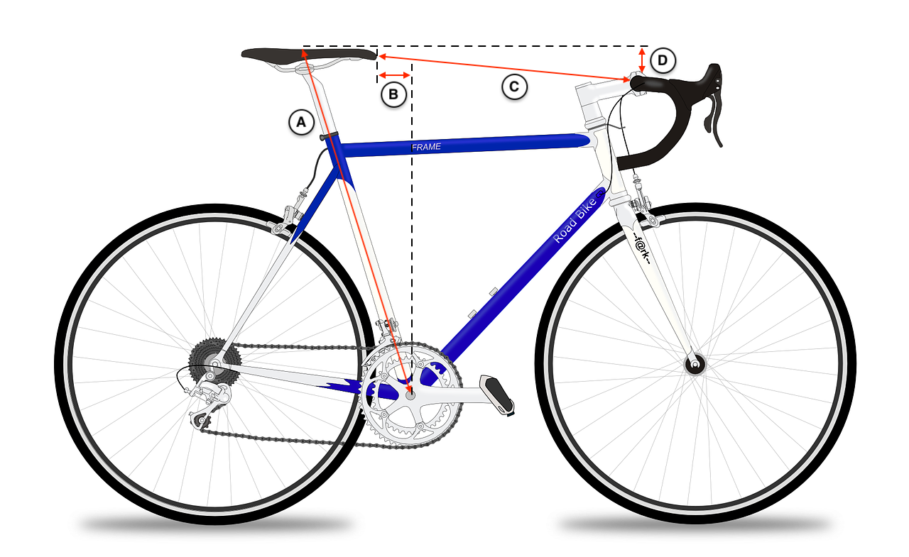
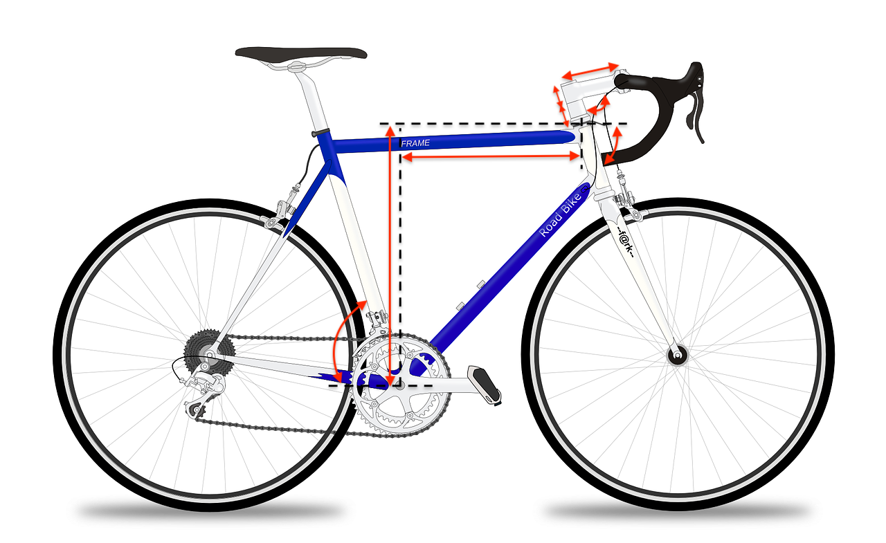

Choisir un vélo adapté à sa pratique est une opération extrêmement complexe, tout simplement parce que le cadre d'un vélo est un composant qui comporte de nombreux paramètres.

Parmi ces paramètres nous pouvons citer :
  - le **matériaux** (carbone, acier, aluminium, titane, etc.)
  - la **forme des tubes** (rond, ovale, diamètre, épaisseur, etc.)
  - la **géométrie du cadre** (longueur des tubes, angles , etc.)

Ici, nous nous intéressons à la géométrie des cadres de vélo :

À nouveau, il y a de nombreux paramètres, mais nous allons distinguer les paramètres qui ont une influence sur la forme et le comportement du vélo de ceux qui ont une influence directe sur la **position du cycliste** sur le vélo.

Considérons la longueur des bases arrières par exemple (`425mm` sur l'illustration ci-dessus), cela a une influence sur la **forme** du vélo, sur l'espace disponible pour le pneu, sur le **comportement** du vélo (réactivité, maniabilité), sur le **confort** du vélo (filtration). Mais cela a peu d'impact sur la **position du cycliste** (façon de pédaler, inclinaison du buste, position des mains, etc.).

### *Position du cycliste sur le vélo*

Lorsqu'on s'intéresse à la position du cycliste sur le vélo on s'aperçoit qu'il y a finalement assez peu de paramètres qui sont directement liés à la position. En pratique seuls les points de contact comptent, et il y en a trois :
  - la selle
  - le cintre
  - les pédales

En faisant abstraction du comportement du vélo, seuls les positions relatives de ces trois points ont de l'influence sur la position du cycliste. 

Ces positions relatives peuvent être caractérisées par 4 mesures :
- la **hauteur de selle**, mesurée par rapport à l'axe du pédalier, le long du tube de selle
- le **recul de selle**, mesuré horizontalement entre le bec de selle et l'axe du pédalier
- la **distance entre la selle et le cintre**, mesurée entre le bec de selle et le point du cintre le plus proche
- la **différence de hauteur entre la selle et le cintre**, mesurée verticalement entre le sommet de la selle et le point du cintre le plus haut. 

### *Changement de vélo*
Lorsqu'on se met en quête de changer de vélo il faut considérer plusieurs choses :
  - l'esthétique (forme des tubes, forme du cadre, dégagement pour les pneus, etc.)
  - le comportement du nouveau vélo (rigidité latérale, rigidité verticale, filtration, agilité, empattement, etc.)
  - la position que l'on pourra avoir dessus

Ce site n'a pas à vocation de vous aider à choisir les 2 premiers critères. 
Par contre, il va pouvoir vous aider à trouver un cadre qui permette de vous positionner d'une façon donnée.

Pour cela vous devez entrer la **géométrie** de votre nouveau vélo.

### *Géométrie d'un cadre*

