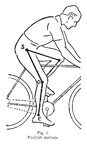
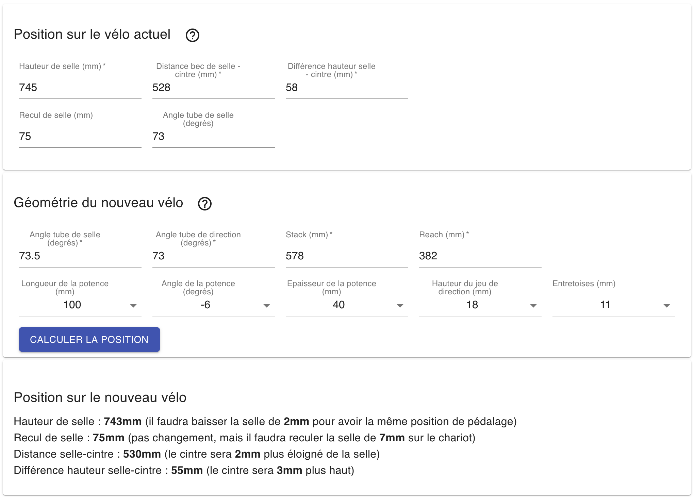

Vous avez un vélo et vous êtes **bien positionné dessus**, 
cette application va vous aider à trouver un cadre et à adapter les périphériques (potence et entretoises) pour retrouver une position identique sur votre nouveau vélo.

Cette application prend en compte tous les paramètres pour vous garantir :
  - une **position de pédalage** identique
  - un **positionnement du cintre** au plus proche de votre position actuelle
    

Pour cela vous aller devoir faire trois choses :
  - entrer les **cotes de votre position actuelle**
  - entrer la **géométrie** de votre futur cadre
  - sélectionner des périphériques

### Prise de cotes
La prise de cote est assez simple et repose sur 3 valeurs :

  - la **hauteur de selle**, prise de l'axe de pédalier au sommet de la selle
  - la distance **selle-cintre**, prise du bec de selle jusqu'au cintre
  - la **différence de hauteur selle-cintre**, prise du sommet de la selle au sommet du cintre

En option vous pouvez entrer 2 autres valeurs :
  - le **recul de selle**, distance horizontale entre l'axe du pédalier et le bec de selle
  - l'**angle du tube de selle** (cet angle est souvent compris entre 72 et 75 degrés)
  
L'entrée de ces deux valeurs permettent à l'application de vous donner des indications plus précises.

### Géométrie du nouveau cadre
La géométrie repose sur 4 valeurs :
  - l'**angle du tube de selle** (souvent compris entre 72 et 75 degrés)
  - l'**angle du tube de direction** (souvent compris entre 72 et 74 degrés)
  - le **stack**
  - le **reach**
  
Ces valeurs sont habituellement données par les constructeurs de cadres.

### Choix de périphériques
La, vous vous devez donner 2 informations obligatoires :

  - l'**épaisseur** de la potence (de l'ordre de 40mm)
  - la **hauteur** du jeu de direction (l'écrou du jeu de direction a souvent une hauteur comprise entre 10 et 20mm)

Ensuite vous pouvez choisir une potence et des entretoises en fixant certaines caractérisques parmi :
  - la **longueur** de la potence
  - l'**angle de la potence** (il est souvent de -6 degrés, ou de 84 degrés ce qui est équivalent)
  - la **hauteur des entretoises** 

Mais vous avez aussi la possibilité de laisser l'application vous proposer le meilleur choix possible pour reproduire au mieux votre position actuelle.

### Ce que l'application calcule

Avec ces paramètres, l'application va calculer pour vous les deux cotes principales :
  - la distance **selle-cintre**
  - la **différence de hauteur selle-cintre**

Pour assurer une position de pédalage identique, le recul de selle ne doit pas être modifié.
L'application calcule également une *nouvelle* hauteur de selle. En effet, pour assurer une **position de pédalage identique**, la hauteur de selle peut être amenée à changer très légèrement, en fonction du nouvel angle de tube de selle.

C'est donc en ajustant la **longueur de la potence**, la **hauteur des entretoises**, et éventuellement l'**angle de la potence** que l'on peut essayer de reproduire les cotes à l'identique.

En fixant l'angle de la potence mais en laissant libre le choix de la longueur de la potence ainsi que la hauteur des entretoises, l'application peut calculer un meilleur choix de périphériques. 

Lisez l'article suivant pour voir [comment saisir la position sur votre vélo actuel](/articles/utilisation/position).

