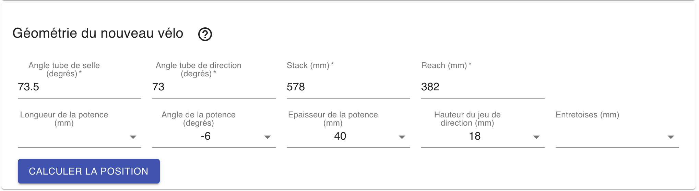

### Géométrie du cadre

Nous utilisons 4 paramètres de la géométrie du cadre pour effectuer nos calculs : 
l'**angle du tube de selle**, l'**angle du tube de direction**, le **stack** et le **reach**.

Pour connaitre ces différentes valeurs, reportez vous à la documentation de votre vélo ou bien au tableau de géométrie donné par le constructeur.

Les angles s'expriment en degrés et sont sont compris entre 70 et 75 degrés. Une valeur avec virgule peut être saisie.
Les longueurs s'expriment en `mm`.

### Caractéristiques des périphériques

En utilisant les différents menu-déroulants il faut sélectionner :
  - la **longueur** de la potence.\
    Cette valeur est souvent comprise entre `80mm` et `120mm`. Il s'agit de la mesure prise entre les deux axes.
  - l'**angle de la potence**\
    Cette valeur est souvent de *-6 degrés*. La désignation *84 degrés* est parfois utilisée par les fabricants. La valeur 6 correspond à la soustraction *90 - 84*.\
    *6 degrés* correspond à une potence *retournée* pour monter la hauteur du cintre.\
    *-6 degrés* correspond à un montage *standard*, qui abaisse la hauteur du cintre.
  - l'**épaisseur** de la potence\
    Cette valeur correspond à la longueur du tube de la potence, qui se trouve autour du tube de fourche.\
    Cette valeur est souvent de l'ordre de `40mm`
  - la **hauteur du jeu de direction**\
    Il s'agit de la **hauteur de l'écrou** qui permet de serrer le jeu de direction.\
    Cet écrou a souvent une hauteur comprise entre `10mm` et `20mm` suivant les montages.\
    L'utilisation d'un pied à coulisse permet de mesurer précisément cette valeur.
  - la **hauteur des entretoises**\
    Ce sont les entretoises comprises entre le jeu de direction et la potence.

Il est également possible de laisser vide une ou plusieurs valeurs parmi la **longueur de la potence**, l'**angle de la potence**, et la **hauteur des entretoises**, l'application cherchera alors les meilleurs dimensions. 

Lisez l'article suivant pour voir [comment interpréter les résultats](/articles/utilisation/resultats).
