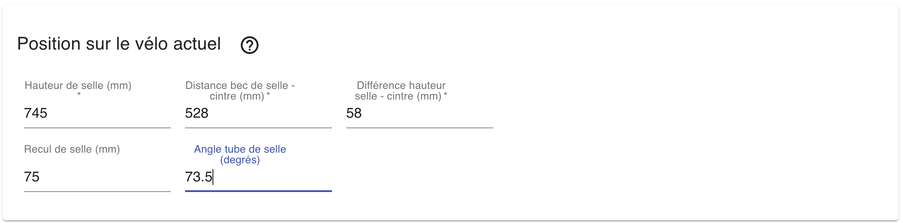
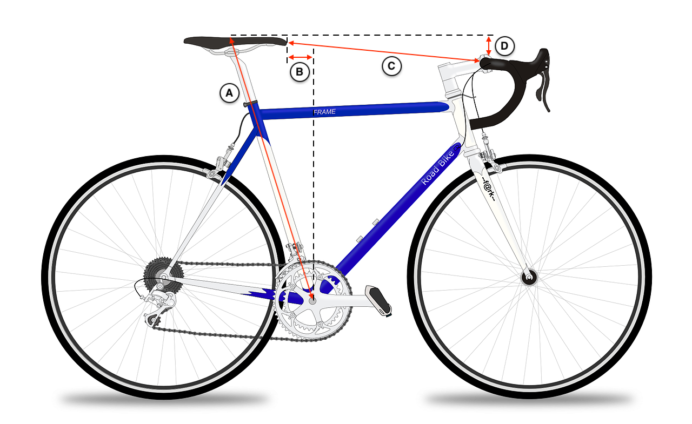
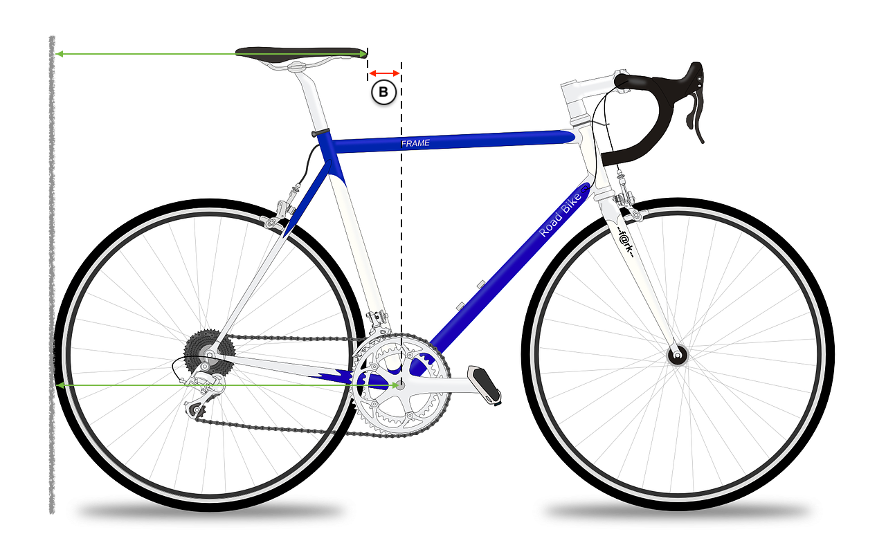
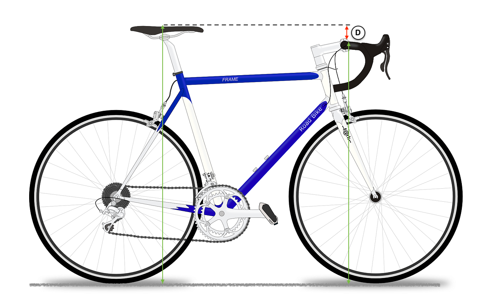

### Saisie des valeurs

Les différentes longueurs s'expriment en `mm`. Ainsi, une hauteur de selle de `74.5cm` s'écrira `745`.

Pour saisir un nombre avec une virgule, il se peut que vous ayez à écrire le nombre avec un point, comme dans l'exemple ci-dessus : `73.5` pour l'angle du tube de selle.

Les 3 premières valeurs (indiquées avec une `*`) sont obligatoires.
Le recul de selle et l'angle du tube de selle sont facultatifs. Cependant, la saisie du recul de selle permettra à l'application de vous donner une distance selle-cintre plus précise.
La saisie de l'angle de tube de selle permettra de calculer le réglage de la hauteur de selle sur votre nouveau vélo.

### Prise de cotes
La prise de cote est assez simple et repose sur 4 valeurs :

#### *Mesure de la hauteur de selle*
Il faut mesurer la distance entre l'**axe du pédalier** et le **sommet de la selle**, en suivant l'inclinaison du long du tube de selle.

Pour être précis, vous pouvez (suivant le type de pédalier) :
  - insérer une clé Allen dans l'axe du pédalier. Le diamètre dépend du type de pédalier. Supposons que ce soit `8mm`
  - effectuer la mesure entre un pan de la clé et le sommet de la selle
  - puis ajouter à cette mesure la motié du diamètre de la clé (ici `4mm`, car nous avons utilisé une clé de `8mm`)

#### *Mesure de la distance selle-cintre*
Il faut prendre cette mesure du bec de selle jusqu'au point du cintre le plus près de la selle, comme illustré par la flêche `(C)` sur le dessin ci-dessus.\
Notez que la mesure s'arrête au cintre, et non *au dessus* du cintre.

#### *Mesure du recul de selle*

Pour mesurer le recul de selle par rapport à l'axe du pédalier, le plus simple est de mettre la roue arrière du vélo contre un mur et de mesurer :
  - la distance entre le **mur** et l'**axe du pédalier**\
    vous pouvez à nouveau utiliser une clé Allen pour rendre la mesure plus précise 
  - ensuite, sans bouger le vélo il faut mesurer la distance entre le **mur** et le **bec de selle**

Le recul de selle correspond à la **différence entre ces 2 valeurs**.

#### *Mesure de la différence de hauteur selle-cintre*

Pour mesurer la différence entre la hauteur de la selle et la hauteur du cintre il faut procéder de façon analogue :
  - mesurer la distance entre le **sol** et le **sommet de la selle**
  - mesurer  la distance entre le **sol** et le **sommet du cintre**

La différence de hauteur selle-cintre correspond à la **différence entre ces 2 valeurs**.

#### *Angle du tube de selle*
Pour connaitre l'angle du tube de selle, reportez vous à la documentation de votre vélo ou bien au tableau de géométrie donné par le constructeur.\
Si vous ne connaissez pas cette valeur, ne saisissez rien dans le formulaire

Lisez l'article suivant pour voir [comment saisir la géométrie de votre futur cadre](/articles/utilisation/geometrie).
