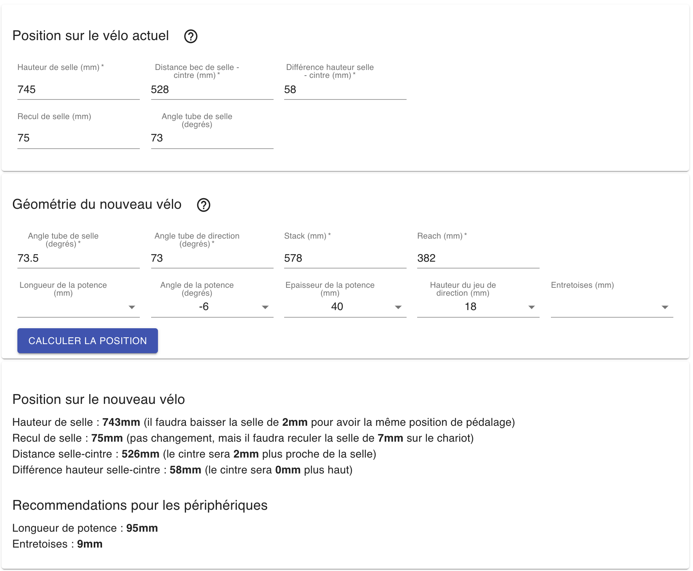

### Géométrie du cadre

Lorsque tous les paramètres sont entrés, l'application calcule automatiquement la position que vous aurez sur le cadre dont vous avez donné la géométrie :
  - **recul de selle**\
    Pour assurer une position de pédalage identique (c'est à dire une même position de la selle par rapport à l'axe du pédalier), le recul de selle ne **doit pas être modifié**. Par contre, si l'angle du tube de selle change, pour conserver ce même recul de selle par rapport au pédalier, il faudra modifier le réglage au niveau du chariot de selle. L'application vous dit comment effectuer ce réglage : dans l'exemple ci-dessus il faut reculer la selle de 7mm sur le chariot de selle (en supposant que le modèle de chariot soit le même).
  - **hauteur de selle**\
    Ce n'est pas très intuitif, mais si l'angle du tube de selle du nouveau cadre n'est pas identique à celui de votre cadre actuel, il va falloir modifier légèrement la hauteur de selle pour assurer une **position de pédalage identique**.\
    L'exemple ci-dessus nous montre qu'un changement d'angle de **0.5 degré** (de 73 degrés à 73.5 degrés) demande de baisser la selle de **2mm** pour assurer une même position de pédalage.\
    Pour comprendre ce phénomène il faut remarquer que plus 
    l'angle est élévé, plus la selle se trouve *haute* par rapport à l'axe du pédalier. Il faut donc la baisser si on veut conserver une différence de hauteur constante.\
    L'application calcule cette **nouvelle hauteur de selle**.
  - **distance selle-cintre**\
    En considérant le recul de selle et la nouvelle hauteur de selle, l'application calcule la distance du bec de selle jusqu'au cintre, en tenant compte des paramètres des périphériques.
  - **différence de hauteur selle-cintre**\
  A nouveau, en considérant le recul de selle et la nouvelle hauteur de selle, l'application calcule la différence de hauteur entre la selle et le cintre.

Dans certains cas la géométrie du nouveau cadre est telle qu'il est difficile de reproduire à l'identique votre position actuelle. Lorsque la différence de hauteur selle-cintre vous amène à mettre trop d'entretoises (plus de 60mm par exemple), vous pouvez alors tenter de *retourner* la potence en mettant un angle positif (+6 degrés par exemple).

Lorsque des valeurs sont laissées vides pour certains périphériques, l'application cherche alors les meilleures dimensions pour minimiser les différences entre la position calculée et la position actuelle. Les résultats sont présentés dans la partie "Recommendations". 

Lisez l'article suivant pour comprendre [sur quoi se base l'application pour effectuer les calculs](/articles/explications/).

